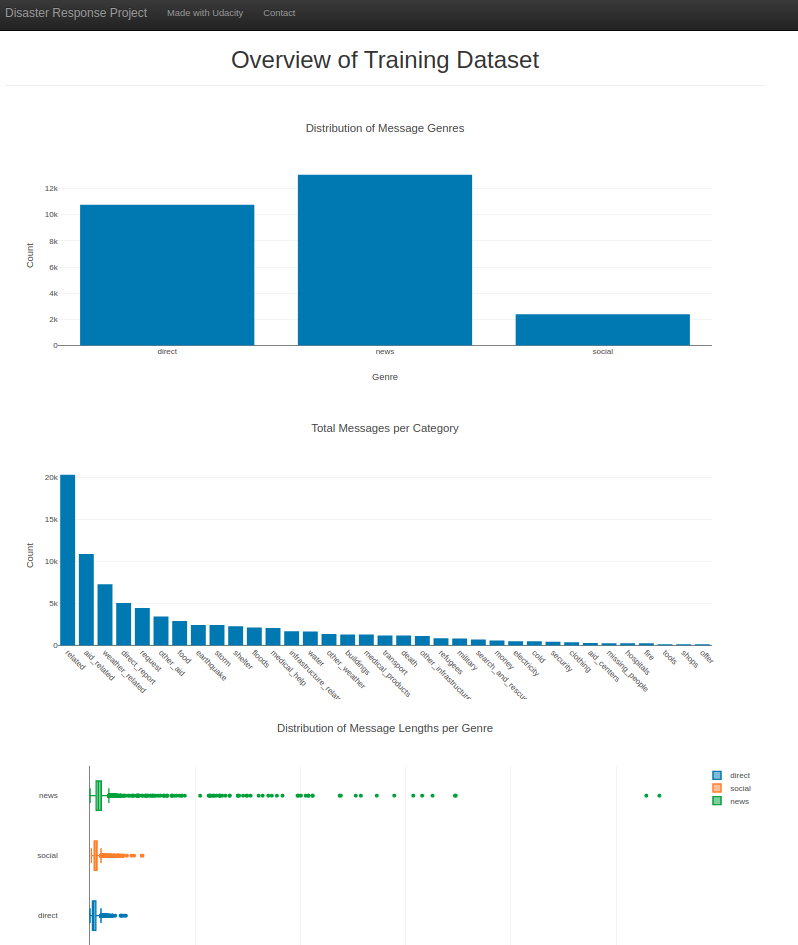
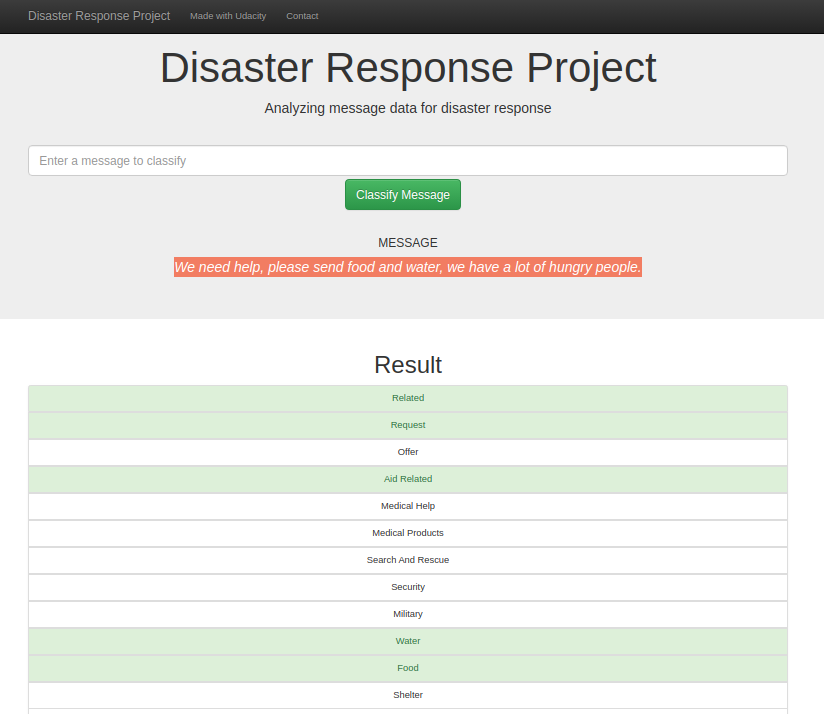

## Disaster Response Pipeline

We live in a highly connected world, where virtually everyone can reach a myriad of people in a matter of seconds. 
This becomes a challenge for relief organizations when disasters strike, as victims desperately send messages of 
all kinds in overwhelming numbers. 

Some of those messages may carry valuable information if they reach the appropiate responders and in many cases, 
they could even make the difference between life and death. But reading and classifying each and every message in 
order to forward it to the appropriate organization, would be a daunting task.

The purpose of this project is to build a model to classify text messages in a pre-defined set of categories. 
This classification may prove valuable in determining the type of information contained in the message and the 
organization that is better qualified to respond.

### Methodology

With this idea in mind, we built and trained a supervised classification model using 
[Support Vector Classifiers](https://scikit-learn.org/stable/modules/generated/sklearn.svm.SVC.html). 
We trained the model on a real dataset of categorized texts, provided by [Figure Eight](https://www.figure-eight.com/). 
The resulting model can be used by operators to estimate the categories associated with a new text message.

#### Data cleaning

The data contained some messages not associated with any categories. Those non-categorized messages were useless 
for training the model, so we removed them. We also removed duplicate records. 

We looked for single-valued columns and dropped them, as they didn't provide any useful information for 
classifying messages. In the data provided with the project, we found that the category column *alone_child* 
was the only single-valued one and hence, we dropped it.

#### Feature extraction

Since our input consists of text messages, it was necessary to normalize and transform the text into a numerical 
representation. We used [NLTK's](https://www.nltk.org/) [word_tokenizer](https://www.nltk.org/api/nltk.tokenize.html) 
and [WordNetLemmatizer](https://www.nltk.org/_modules/nltk/stem/wordnet.html) to transform each message into a list 
of lemmas. 

Subsequently we used [Count Vectorization](https://en.wikipedia.org/wiki/Bag-of-words_model) and 
[TF-IDF](https://en.wikipedia.org/wiki/Tf%E2%80%93idf) to transform the messages into numerical vectors.

#### Model selection

When implementing the model, we evaluated tree types of classifiers: 
[Random Forest](https://scikit-learn.org/stable/modules/generated/sklearn.ensemble.RandomForestClassifier.html), 
[Linear Support Vector Classifier](https://scikit-learn.org/stable/modules/generated/sklearn.svm.LinearSVC.html#sklearn.svm.LinearSVC)
and [RBF Support Vector Classifier](https://scikit-learn.org/stable/modules/generated/sklearn.svm.SVC.html). 

We tunned the parameters of each one of those classifiers by using ScikitLearn's 
[GridSearchCV](https://scikit-learn.org/stable/modules/grid_search.html#exhaustive-grid-search). 
This utility performs an exhaustive exploration of a specific set (grid) of parameter values. 
It finds the combination of parameters that yield the best results by applying 
[Cross Validation](https://en.wikipedia.org/wiki/Cross-validation_(statistics).

The best accuracy we obtained resulted from using an [RBF SVC](https://scikit-learn.org/stable/modules/generated/sklearn.svm.SVC.html), 
with the parameters set in the `build_model` function of the script `model/train_classifier.py`. We provide further 
details about how to evaluate different models in the next section.

#### Results

As a final result, we assembled a web application that gives access to the model. This application allows 
users to predict the categories associated with a text message entered by the user. It displays some plots that
give a basic overview of the training data.

### Dependencies and Setup

This project requires Python 3.6 or above. It has the following dependencies:

- [Numpy](https://numpy.org/).
- [Pandas](https://pandas.pydata.org/).
- [NLTK](https://www.nltk.org/).
- [Flask](https://palletsprojects.com/p/flask/).
- [SQLAlchemy](https://www.sqlalchemy.org/).
- [Joblib](https://joblib.readthedocs.io/en/latest/).
- [Plotly](https://plot.ly/python/).

All the dependencies are listed in the `requirements.txt` file, so you can install them at once by running:

```bash
pip install -r requirements.txt
```

Then, make sure to download NLTK's modules by running the following script in your Python environment:

```python
import nltk

nltk.download('stopwords')
nltk.download('wordnet')
nltk.download('punkt')
```

### Project structure

The source code is organized in three folders:

- Data: 

Contains the dataset of messages and categories that was used to train and test the model. 
Most importantly, it contains the script `process_data.py`, which extracts, cleans and merges the messages 
and categories provided in separate CSV files. Then, it loads the results into an SQLite database at 
the specified path. 

This script can be invoked by running the following command in the project's root directory:

```bash
python data/process_data.py MESSAGES_CSV_PATH CATEGORIES_CSV_PATH TARGET_DB_PATH
```

Arguments MESSAGES_CSV_PATH and CATEGORIES_CSV_PATH are the paths of the CSV files containing messages and categories, 
respectively. Argument TARGET_DB_PATH specifies the path where the script will write the resulting database. 
For example, to load the datasets provided in the project run:

```bash
python data/process_data.py data/disaster_messages.csv data/disaster_categories.csv data/DisasterResponse.db
```

- Models:

The script `train_classifier.py` builds and trains the classification model on the database of messages. It expects 
as argument, the path to the database of messages, previously created by `process_data.py`. The model, trained and 
ready to use for prediction, will be saved as a pickle file at the path specified by the second argument. 
To invoke this script, go to the project's root directory and run:

```bash
python models/train_classifier.py MESSAGES_DB_PATH MODEL_PICKLE_PATH
```

The first argument, MESSAGES_DB_PATH should be the path to the messages database. The second argument, 
MODEL_PICKLE_PATH, specifies the path where the model is to be saved as a pickle file.
For example, to load the messages database saved above to train the model, run:

```bash
python models/train_classifier.py data/DisasterResponse.db models/classifier.pkl
```

Training the model may take a while (we are talking about 30 minutes), so please be patient.

We used ScikitLearn's [GridSearchCV](https://scikit-learn.org/stable/modules/grid_search.html#exhaustive-grid-search) 
to find the parameters of the model that gave us the best results. This is implemented in the script 
`tune_classifier.py`, which can be invoked with the path of the messages database as argument:

```bash
python models/tune_classifier.py data/DisasterResponse.db
```

The script will search for the best combination of parameters defined in the function `get_params_grid_for_svc` 
when applied to our model. However, it can be easily modified to try different algorithms and combinations 
of parameters. Just create the model you would like to try in the `main` function. Then create your version of  
`get_params_grid_for_your_model` that returns a grid of parameters for your model. Finally, invoke the `tune_classifier` 
function with your model and your grid of parameters.

- App:

This is a web application that allows non-technical users to classify text messages through the model. It also 
displays some charts giving an overview of the training data. The application was implemented using 
[Flask](https://palletsprojects.com/p/flask/) and [Plotly Python](https://plot.ly/python/).   

The templates folder contains two HTML files. The main page, master.html and its extension, go.html. The main page 
defines the structure of the website and displays the charts generated by the controller, `run.py`. It is extended 
by go.html, which gets rendered when the user clicks the 'Classify Message' button. 

Clicking this button submits the message entered by the user to the controller. The request is handled by the route 
'go', which predicts the classification of the message using the model. Then this route renders go.html, thus showing 
the result.

The script `run.py` acts as the controller of the web application. That is, it implements the routes that handle 
user's requests. Plots are built by the helper class PlotBuilder, defined in the script `visualization.py`. 
We implemented each plot in its own method of the class PlotBuilder, as a Python dictionary in 
[Plotly Python](https://plot.ly/python/) format.

To start the web application, go to the project's root directory and run:

```bash
python app/run.py 
```

In your favorite browser, go to `http://0.0.0.0:3001/` to access the web application.

The home page summarizes the training data by displaying some charts.



To classify a text message, write it in the input field and click the 'Classify Message' button. You will see a list 
of the categories estimated by the model as associated with the message.

 